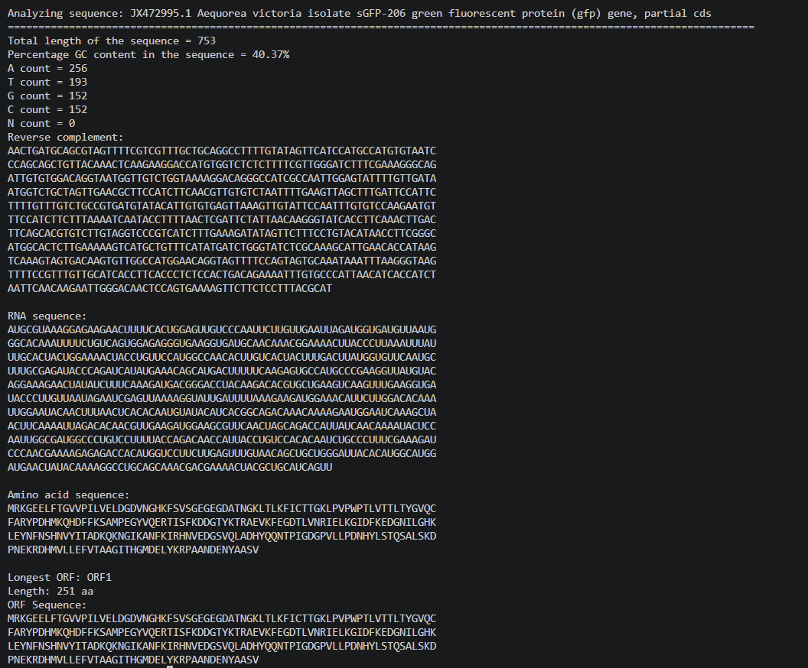

# 🧬 DNA Sequence Analyzer

This DNA Sequence Analyzer was built as a part of my summer learning in the field of bioinformatics. This project reads DNA sequences from a FASTA file and performs several common sequence analysis tasks, including GC content calculation, reverse complement generation, transcription, translation, and open reading frame (ORF) detection.

As a second-year Biotechnology and Bioinformatics student, this project helped me revise the basics of molecular biology while giving me an opportunity to implement the basic Python I learned throughout the summer. Overall, this project was very informative and fun to build.

---

## Features

- Reads one or more DNA sequences from a FASTA file
- Calculates sequence length
- Calculates GC content (%)
- Counts occurrences of each nucleotide (A, T, G, C, and N)
- Generates the reverse complement of the DNA sequence
- Transcribes DNA into RNA
- Translates RNA into a one-letter amino acid sequence using the standard genetic code
- Identifies Open Reading Frames (ORFs)
- Reports the longest ORF found
- Handles invalid nucleotide characters and missing input files gracefully

---

## Requirements

- Python 3.x
- No external libraries required (uses only Python's standard library)

---

## Installation

Clone the repository:

```bash
git clone https://github.com/s-n-e-h-a-03/dna-analyzer.git
cd dna-analyzer
```

---

## Usage

Run the program by providing a FASTA file as a command-line argument.

```bash
python main.py sample_data_GFP.fasta
```

If no filename is provided, the program displays:

```text
Usage: python main.py <fasta_file>
```

---

## Input Format

The program accepts DNA sequences in standard FASTA format.

Example:

```text
>Sequence_1
ATGCGTAAAGGAGAAGAACTTTTCACTGGAGTTG

>Sequence_2
ATGGCCATTGTAATGGGCCGCTGAAAGGGTGCC
```

Multiple sequences can be included in a single FASTA file.

---

## Example Output

Sample run using a real GenBank record (accession [JX472995.1](https://www.ncbi.nlm.nih.gov/nuccore/JX472995.1), *Aequorea victoria* GFP gene, partial cds):

```text
Analyzing sequence: JX472995.1 Aequorea victoria isolate sGFP-206 green fluorescent protein (gfp) gene, partial cds
==========================================================================================================
Total length of the sequence = 753
Percentage GC content in the sequence = 40.37%
A count = 256
T count = 193
G count = 152
C count = 152
N count = 0

Reverse complement:
AACTGATGCAGCGTAGTTTTCGTCGTTTGCTGCAGGCCTTTTGTATAGTTCATCCATGCCATGTGTAATC
CCAGCAGCTGTTACAAACTCAAGAAGGACCATGTGGTCTCTCTTTTCGTTGGGATCTTTCGAAAGGGCAG
...

RNA sequence:
AUGCGUAAAGGAGAAGAACUUUUCACUGGAGUUGUCCCAAUUCUUGUUGAAUUAGAUGGUGAUGUUAAUG
GGCACAAAUUUUCUGUCAGUGGAGAGGGUGAAGGUGAUGCAACAAACGGAAACAUUCCUUAAAUUUAU
...

Amino acid sequence:
MRKGEELFTGVVPILVELDGDVNGHKFSVSGEGEGDATNGKLTLKFICTTGKLPVPWPTLVTTLTYGVQC
FARYPDHMKQHDFFKSAMPEGYVQERTISFKDDGTYKTRAEVKFEGDTLVNRIELKGIDFKEDGNILGHK
...

Longest ORF: ORF1
Length: 251 aa
ORF Sequence:
MRKGEELFTGVVPILVELDGDVNGHKFSVSGEGEGDATNGKLTLKFICTTGKLPVPWPTLVTTLTYGVQC
FARYPDHMKQHDFFKSAMPEGYVQERTISFKDDGTYKTRAEVKFEGDTLVNRIELKGIDFKEDGNILGHK
...
```

*(Output truncated for brevity. Running the program prints the complete sequences.)*

### Screenshot

The repository also includes a screenshot of the program analyzing the GFP sequence.



---

## Data Source

The sample FASTA file (`sample_data_GFP.fasta`) is derived from the NCBI GenBank record:

- **Accession:** JX472995.1
- **Organism:** *Aequorea victoria*
- **Description:** Green fluorescent protein (GFP) gene, partial coding sequence (cds)

Source: https://www.ncbi.nlm.nih.gov/nuccore/JX472995.1

---

## Project Structure

```text
dna-analyzer/
│
├── LICENSE
├── README.md
├── main.py
├── sample_data_GFP.fasta
└── screenshots/
    └── output.png
```

---

## How It Works

1. Reads one or more DNA sequences from a FASTA file.
2. Calculates sequence length.
3. Computes GC content and nucleotide frequencies.
4. Generates the reverse complement.
5. Transcribes DNA into RNA.
6. Translates RNA into a protein sequence using the standard genetic code.
7. Detects Open Reading Frames (ORFs) beginning with methionine (`M`) and ending with a stop codon (`*`).
8. Reports the longest ORF identified.

---

## Biological Concepts

This project demonstrates several fundamental bioinformatics concepts:

- FASTA file parsing
- DNA sequence analysis
- GC content calculation
- Reverse complement generation
- DNA transcription
- RNA translation
- Genetic code (codon table)
- Open Reading Frame (ORF) detection

---

## Error Handling

The program checks for:

- Missing FASTA files
- Invalid DNA characters
- Empty sequences
- Missing command-line arguments

Appropriate error messages are displayed to help identify input errors.

---

## Future Improvements

Potential additions include:

- Translation in all six reading frames
- Detection of overlapping ORFs
- Support for ambiguous IUPAC nucleotide codes
- Codon usage statistics
- Protein molecular weight calculation
- Amino acid composition analysis
- Exporting results to CSV or text files
- Unit tests for core functions

---

## What I Learned

Through this project, I gained practical experience with:

- Python programming
- File handling
- Dictionaries and string manipulation
- Modular programming
- Exception handling
- Command-line arguments (`sys.argv`)
- Applying molecular biology concepts through code

---

## Author

**Sneha Sudheer**

Second-year Biotechnology student at Indian Institute of Technology, Hyderabad with an interest in bioinformatics, computational biology, and Python programming.

---

## License

This project is licensed under the MIT License. See the [LICENSE](LICENSE) file for details.
